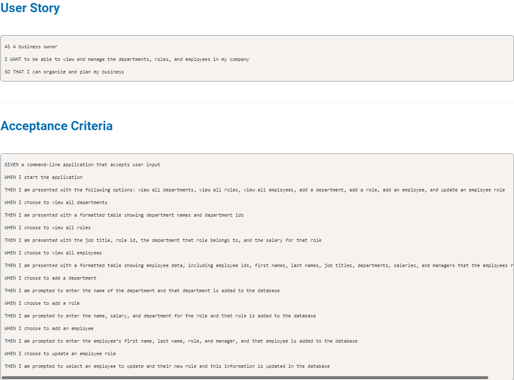

# Employee-Tracker      
# Description 

This project allows us to easily view and manage the departments, roles, and employees in the company. Once application is started we are given menu of options we can possibly do in database, such as view all departments, roles, and employees, or add departments, roles, and employees, update department, roles, or employees, view employees by manager, or department, and view utilized budget by department.

# Table of content 
* [Installation](#installation)
* [Usage](#usage) 
* [Links](#links) 
* [Questions](#questions) 

# Installation 

```
git clone git@github.com:Jelenarog/Employee-Tracker.git
```
Npm packages used for this application:
```
npm init
npm install mysql2
npm install sequelize
npm install dotenv
```
# Usage 
Run the following command at the root of your project:<br>

Log in into mySql:
```
mysql -u root -p
```
Enter your mySql password
Source database:
```
source db/schema.sql
```
Seed data base:
```
source db/seeds.sql
```
Exit mySql:
```
quit
```
Run the application
```
node server
```

# License 

This application is covered under MIT, to find more information about it click on https://choosealicense.com/licenses/mit/. 
# Links 

Github repo: https://github.com/Jelenarog/Employee-Tracker <br>
Demo: https://drive.google.com/file/d/1MmRUyoacUSr0BXlVL0THoKjPOKXPYHHW/view


# Questions 

If you have any additional questions you can reach me at jelena.rogic90@gmail.com. 

Link to my Github profile: https://github.com/JelenaRog
